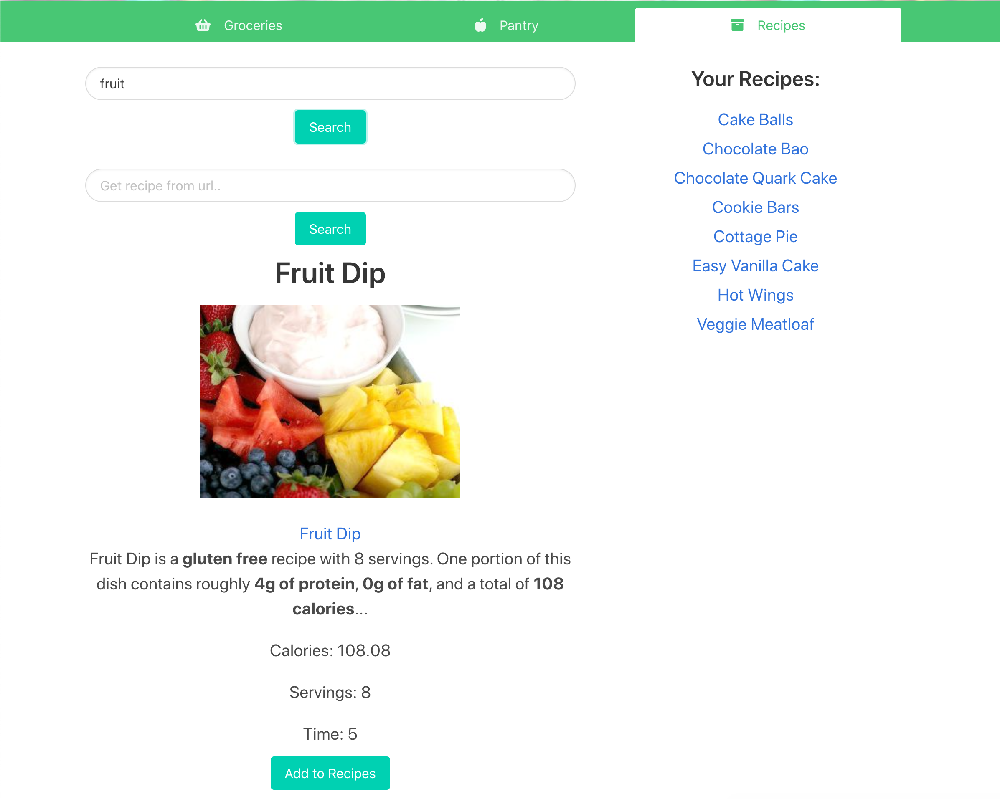
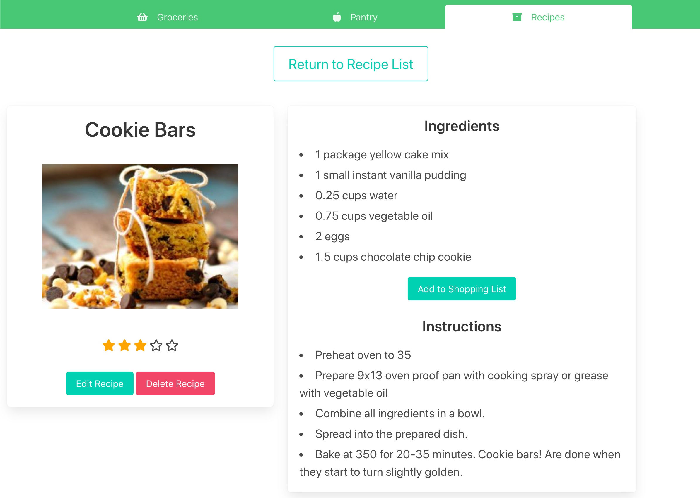

<h1>HASHED</h1>

<h2><u>Overview:</u></h2>

With Hashed you can create a shopping list, pantry list, and save your favorite recipes for later. <strong>Completed your grocery run?</strong> Add those items straight to your pantry. <strong>Running low on your favorite snack?</strong> One button click and it's back on the list. You can also add everything you need straight from your saved recipes to ensure you never miss an ingredient.

 
    
<h2><u>The Team:</u></h2>
<h3>Brittani Ericksen: https://github.com/brittani-ericksen</h3>

<b>Primary Team Role:</b> 

<b>Contributions:</b> 

 
<h3>Matthew Everett: https://github.com/Mjheverett</h3>

<b>Primary Team Role:</b> UI/UX

<b>Contributions:</b> Bulma enthusiast, layout and formatting guru.

 
<h3>Ryan Schniederjan: https://github.com/rynoschni</h3>

<b>Primary Team Role:</b> API integration & graphics

<b>Contributions:</b> Setup the API script for the Grocery and Pantry routes.  Built the API auto-fill in the search to better guide users with their selections.  Created the user profile page, route, and model for user to update their information.  Created the logo, homepage and hero images.

 
<h3>Eric Schorling: https://github.com/willeschor</h3>

<b>Primary Team Role:</b> Database Routes

<b>Contributions:</b> JavaScript wizard. Built routes to connect pages and data throughout pages. Created DOM manipulation within each page to provide improved user experience and allow both frontend and backend worked together to update pages.

 

<h2><u>What We Used:</u></h2>
<h3>Languages:</h3>
<ul>
    <li>Node.js</li>
    <li>Express</li>
    <li>PostgreSQL</li>
    <li>HTML5</li>
    <li>CSS</li>
    <li>JavaScript</li>
</ul>
<h3>Frameworks:</h3>
<ul>
    <li>Bulma</li>
</ul>
<h3>APIs:</h3>
<ul>
    <li><a href="https://spoonacular.com/food-api">Spoonacular - Academic</a></li>
</ul>
 

<h2><u>MVP (Minimum Viable Product):</u></h2>
<ul>
    <li>Add and remove items to a Grocery list.</li>
    <li>Mark items as completed while shopping.</li>
    <li>Recipe list to store and view ingredients and instructions.</li>
</ul>
 

<h2><u>Stretch Goals Completed:</u></h2>
<ul>
    <li>Recipe search by name and url.</li>
    <li>Move items between grocery and pantry lists.</li>
    <li>Add all items from recipe to grocery list.</li>
    <li>Edit quantities of items on grocery and pantry lists.</li>
    <li>Edit item names and units on grocery and pantry lists.</li>
</ul>
 

<h2><u>Stretch Goals Future:</u></h2>
<ul>
    <li>Automatically merge quantities of the same items when added to lists.</li>
    <li>Recipe editing and creation.</li>
    <li>Nutritional information.</li>
    <li>User settings for fields to view.</li>
    <li>Recipe Sharing and/or community.</li>
</ul>
 

<h2><u>Challenges & Solutions:</u></h2>
<h3>Some of the biggest challenges we faced with this project build included:</h2>
 

<b>Challenge:</b> Create a link between recipes and grocery list. 

<b>Solution:</b> Set up a specific route to handle the movement of items to the grocery list. Connected the two areas through this link. All data is presented in a string so had to set up logic to parse the string into a usable version for the database and add each item properly. Also, ensured that data was population from recipe add to database by setting up string to build properly from array provided by API JSON.

 

<b>Challenge:</b> Create a solid DOM / Database interaction to make updating items easier on Pantry and Grocery lists.

<b>Solution:</b> Utilized DOM manipulation through Vanilla JS in a scripts file to create responsive design that added and removed elements as the user interacted with the page. Utilized forms throughout the page to collect data that was changed and send it back to the database. This required the use of some hidden fields and some additional logic to tie the updated data to the database without displaying unwanted data to the user. 

 

<h2><u>Screenshots:</u></h2>

<h3>Recipe Search and List:</h3>

<h3>Recipe Page:</h3>

